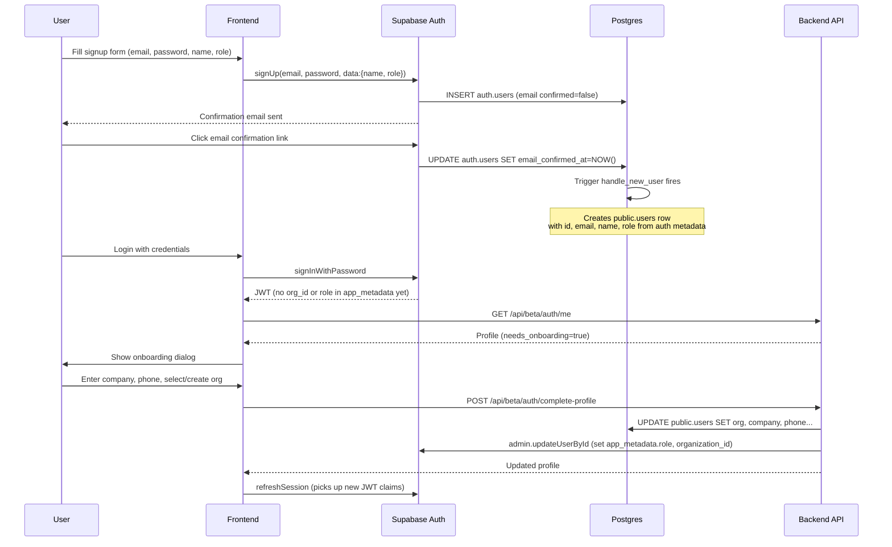

# Signup Flow Implementation

## Current State

- **Frontend**: `AuthContext.jsx` already has an unused `register(email, password, name)` function calling `sb.auth.signUp()`. No signup UI exists.
- **Backend**: `auth_router.py` `/me` endpoint falls back to JWT claims when no `public.users` row exists. No `auth.users` -> `public.users` sync trigger in the DB.
- **Database**: `public.users` has `id, email, password, name, role, company, billing_entity, billing_entity_id, phone, is_active, organization_id, created_at`. The `password` column stores a bcrypt hash used by `contractor_service.py`. `billing_entity` is a denormalized name string alongside the `billing_entity_id` FK.
- **Auth flow**: Seeds manually insert matching rows into both `auth.users` (with `raw_app_meta_data` containing `role` + `organization_id`) and `public.users`. No trigger automates this.

## Data Flow Diagram



## Schema Changes (Simplifications)

### Remove `users.billing_entity` text column (bloat removal)

The `billing_entity` TEXT column on `public.users` is a denormalized copy of the billing entity name. The canonical name lives on `billing_entities.name` via `billing_entity_id` FK. Every read path that needs the name can JOIN. This column causes silent drift and duplicates data.

**Action**: Drop `billing_entity` column from `users` table, update `01-shared-schema.sql`, generate migration, update all backend code that reads/writes this column.

### Remove `users.password` column (bloat removal)

Supabase Auth owns password storage in `auth.users.encrypted_password`. The `password` column in `public.users` is a parallel bcrypt hash used only by `contractor_service.create_contractor()` - a remnant from pre-Supabase days. With signup going through Supabase Auth, this column is dead weight.

**Action**: Drop `password` column from `users` table, update schema, update `contractor_service.py` to stop writing passwords, update seed data.

### Remove `refresh_tokens` and `oauth_states` tables

These are pre-Supabase auth infrastructure. Supabase manages its own refresh tokens and OAuth state. No application code references these tables (confirmed by grep).

**Action**: Drop both tables from `01-shared-schema.sql`, remove their RLS policies from `11-rls-policies.sql`, generate migration.

## Database: New Trigger Function

Create `handle_new_user()` trigger on `auth.users` INSERT that creates a `public.users` row:

```sql
-- In a new migration (also add to schema files)
CREATE OR REPLACE FUNCTION public.handle_new_user()
RETURNS TRIGGER
LANGUAGE plpgsql
SECURITY DEFINER
SET search_path = public
AS $$
BEGIN
  INSERT INTO public.users (id, email, name, role, is_active, created_at)
  VALUES (
    NEW.id,
    NEW.email,
    COALESCE(NEW.raw_user_meta_data->>'name', ''),
    COALESCE(NEW.raw_app_meta_data->>'role', NEW.raw_user_meta_data->>'role', 'admin'),
    TRUE,
    NOW()
  );
  RETURN NEW;
END;
$$;

CREATE TRIGGER on_auth_user_created
  AFTER INSERT ON auth.users
  FOR EACH ROW EXECUTE FUNCTION public.handle_new_user();
```

This means: the moment Supabase creates the auth user (even before email confirmation), a `public.users` skeleton row exists. The `organization_id` is NULL initially - it gets set during onboarding.

## Backend Changes

### New endpoint: `POST /api/beta/auth/complete-profile`

Located in [backend/api/beta/routers/shared/sub_routers/auth/auth_router.py](backend/api/beta/routers/shared/sub_routers/auth/auth_router.py).

Accepts: `{ company, phone, organization_id?, organization_name? }`

Logic:
1. If admin role and `organization_name` provided -> create new org, set `organization_id` on user
2. If contractor role and `organization_id` provided -> validate org exists, set on user, create/link billing entity
3. Call Supabase Admin API (`supabase.auth.admin.update_user_by_id`) to set `app_metadata.role` and `app_metadata.organization_id` on the auth user - this is critical so future JWTs carry these claims
4. Return updated profile

### New endpoint: `GET /api/beta/auth/organizations` (public-ish)

Returns list of `{id, name}` for all organizations. Used by contractor signup to populate the org dropdown. This needs to work without full auth (user is authenticated via Supabase but has no org_id yet), so it should only require a valid JWT, not org-scoped auth.

### Update `/me` response

Add `needs_onboarding: bool` field to `UserResponse`. True when `organization_id IS NULL` on the user row. Frontend uses this to show the onboarding dialog.

### Access Supabase admin client via `get_database_manager()` pattern

The Supabase admin client infra exists but is only accessible via module-level imports from `supabase.py`. To follow the project's `get_database_manager()` convention, we need to:

1. **Add `async_supabase_admin` property to `BaseDatabaseService`** in [backend/shared/infrastructure/db/base.py](backend/shared/infrastructure/db/base.py). Currently it has sync `supabase` and `supabase_admin` properties (lines 77-82) but no async variants. Add:

```python
# On BaseDatabaseService (base.py lines ~83)
async def get_async_supabase_admin(self):
    return await get_async_supabase(True)

async def get_async_supabase(self):
    return await get_async_supabase(False)
```

This mirrors the existing `RealtimeServiceProxy` pattern (line 130) which also wraps `get_async_supabase(False)`.

2. **Expose on `DatabaseManager`**: Already works for free - `DatabaseManager.db_service` is public, so application code calls:

```python
db = get_database_manager()
sb_admin = await db.db_service.get_async_supabase_admin()
await sb_admin.auth.admin.update_user_by_id(
    user_id,
    {"app_metadata": {"role": role, "organization_id": str(org_id)}}
)
```

3. **No networking/pool impact**: The async Supabase client uses its own HTTP transport (httpx under the hood), completely independent from the SQLAlchemy/asyncpg connection pool. Adding these properties does not open new connections, alter pool config, or affect the Postgres backend in any way. The client is lazy-initialized on first call and cached by fingerprint (URL + key) in `supabase.py` lines 51-60.

4. **Blast radius**: `supabase_admin` (sync) and `supabase` (sync) on `BaseDatabaseService` are defined (lines 77-82) but have zero consumers in the codebase today. `RealtimeServiceProxy` wraps async but also has zero consumers. Adding async admin is additive-only - nothing breaks.

### Update `contractor_service.py`

- Remove `password` parameter and `_hash_password()` from `create_contractor()` 
- Remove `billing_entity` (text) writes; only use `billing_entity_id`
- Update `_SELECT_COLS`, `Contractor` model, `ContractorCreateResult`

### Update `auth_deps.py`

Currently rejects tokens without `organization_id` in deployed environments. New users won't have this claim until onboarding completes. Add an exception: allow the `/auth/me`, `/auth/complete-profile`, and `/auth/organizations` endpoints to work without org_id.

## Frontend Changes

### Modify Login page -> Login/Signup page

Transform [frontend/src/pages/Login.jsx](frontend/src/pages/Login.jsx) to support both sign-in and sign-up modes:

- Add "Sign up" / "Sign in" toggle link below the submit button
- In signup mode: show additional "Name" field, keep email + password
- Pass `role` from the active tab into the `signUp` call as `user_metadata.role`
- Admin signup requires entering the static code (`VITE_ADMIN_LOGIN_CODE`)
- On signup success, show "Check your email for confirmation" message
- On email confirmation + first login, the onboarding dialog triggers

### Update `AuthContext.jsx`

- Enhance `register()` to pass `role` in the signup metadata: `options: { data: { name, role } }`
- After login, if profile has `needs_onboarding: true`, set a flag that triggers the onboarding dialog

### New component: `OnboardingDialog.jsx`

A modal dialog (using existing `dialog.jsx` UI component) that appears after first login when `needs_onboarding` is true:

- **For Admin**: company name, phone, new org name
- **For Contractor**: company name, phone, select org from dropdown
- Calls `POST /api/beta/auth/complete-profile`
- On success, refreshes the Supabase session (to pick up new JWT claims with org_id) and re-fetches profile

### Environment variables

- `VITE_ADMIN_LOGIN_CODE` in `frontend/.env.development` (default `1234`) and `frontend/.env.production`

## Supabase Configuration

- Enable email confirmation in Supabase Auth settings: set `enable_confirmations = true` in [supabase/config.toml](supabase/config.toml) line 211 under `[auth.email]`
- The Supabase admin key is **already configured**: `PRIVATE_SUPABASE_SECRET_KEY` in `backend/.env.local`, exposed via `config.SUPABASE_SECRET_KEY`, used by `get_async_supabase(admin=True)` in [backend/shared/infrastructure/db/supabase.py](backend/shared/infrastructure/db/supabase.py). No new env vars needed.

## Files Changed (Summary)

**Database schema**:
- [supabase/schemas/01-shared-schema.sql](supabase/schemas/01-shared-schema.sql) - remove `password`, `billing_entity` from users; remove `refresh_tokens`, `oauth_states` tables
- [supabase/schemas/11-rls-policies.sql](supabase/schemas/11-rls-policies.sql) - remove RLS for dropped tables; add anon-friendly policy for organizations (read-only for authenticated users without org)
- New schema file for the `handle_new_user()` trigger function
- Generated migration via `supabase db diff`

**Backend**:
- [backend/api/beta/routers/shared/sub_routers/auth/auth_router.py](backend/api/beta/routers/shared/sub_routers/auth/auth_router.py) - new endpoints, updated response model
- [backend/shared/api/auth_deps.py](backend/shared/api/auth_deps.py) - allow onboarding endpoints without org_id
- [backend/operations/application/contractor_service.py](backend/operations/application/contractor_service.py) - remove password/billing_entity text
- [backend/shared/infrastructure/db/base.py](backend/shared/infrastructure/db/base.py) - add `get_async_supabase_admin()` / `get_async_supabase()` methods to `BaseDatabaseService`

**Frontend**:
- [frontend/src/pages/Login.jsx](frontend/src/pages/Login.jsx) - add signup mode
- [frontend/src/context/AuthContext.jsx](frontend/src/context/AuthContext.jsx) - enhance register, add onboarding state
- New `frontend/src/components/OnboardingDialog.jsx`
- [frontend/.env.development](frontend/.env.development) - add `VITE_ADMIN_LOGIN_CODE`

**Seed data**:
- [supabase/seeds/04_users.sql](supabase/seeds/04_users.sql) - remove `password` column from inserts

---

## Testing Strategy

### Existing Tests That Must Be Fixed (Schema Changes)

Dropping `password` and `billing_entity` columns will break existing tests that reference them:

- [backend/tests/api/conftest.py](backend/tests/api/conftest.py) - `_db_with_bcrypt_user` fixture inserts `password` column
- [supabase/seeds/pytest_minimal.sql](supabase/seeds/pytest_minimal.sql) - all `INSERT INTO users` include `password` and `billing_entity` columns
- [backend/tests/api/test_auth_api.py](backend/tests/api/test_auth_api.py) - `test_me_returns_user_profile` asserts `"password" not in data` (still valid but column gone)
- Any test that creates contractors via `create_contractor()` with a `password` param
- [backend/operations/application/contractor_service.py](backend/operations/application/contractor_service.py) - `_SELECT_COLS` references both dropped columns; `Contractor`/`ContractorCreateResult` models reference `billing_entity`

**Fix approach**: Update all seed SQL, remove `password`/`billing_entity` from column lists, update model fields. The `_db_with_bcrypt_user` fixture becomes unnecessary (Supabase owns passwords) - replace with a plain user insert without password.

### Backend API Tests (New)

File: `backend/tests/api/test_signup_api.py`

Uses the same pattern as [test_auth_api.py](backend/tests/api/test_auth_api.py): `client` fixture from `api/conftest.py`, JWT tokens from `tests/helpers/auth.py`.

**Test class: `TestCompleteProfile`** - `POST /api/beta/auth/complete-profile`

| Test | What it verifies |
|------|-----------------|
| `test_complete_profile_requires_auth` | 401 without token |
| `test_admin_creates_new_org` | Admin with no org_id in JWT sends `{company, phone, organization_name}` -> creates org, sets user's org_id, returns profile with `needs_onboarding=false` |
| `test_contractor_joins_existing_org` | Contractor sends `{company, phone, organization_id}` -> links to org, creates billing entity, sets `billing_entity_id` on user |
| `test_contractor_rejects_nonexistent_org` | Contractor sends bogus `organization_id` -> 404 |
| `test_complete_profile_rejects_already_onboarded` | User already has `organization_id` -> 409 conflict |
| `test_complete_profile_missing_required_fields` | Missing company -> 422 |

Test helper needed: `make_token` variant with `org_id=None` (no org claim) to simulate a fresh signup user. Add `onboarding_headers()` to `tests/helpers/auth.py`.

**Test class: `TestListOrganizations`** - `GET /api/beta/auth/organizations`

| Test | What it verifies |
|------|-----------------|
| `test_organizations_requires_auth` | 401 without token |
| `test_organizations_returns_list` | Returns seeded org(s) as `[{id, name}]` |
| `test_organizations_works_without_org_claim` | Token with no `organization_id` still gets 200 (onboarding endpoint) |

**Test class: `TestMeOnboarding`** - updated `GET /api/beta/auth/me`

| Test | What it verifies |
|------|-----------------|
| `test_me_needs_onboarding_true_when_no_org` | User with `organization_id IS NULL` -> `needs_onboarding: true` |
| `test_me_needs_onboarding_false_when_org_set` | Normal user -> `needs_onboarding: false` |

### Frontend Vitest Tests (New)

File: `frontend/src/pages/__tests__/Login.test.jsx`

Uses the existing vitest setup: `@testing-library/react`, `vi.mock` for dependencies, `jsdom` environment (configured in [vite.config.js](frontend/vite.config.js)).

| Test | What it verifies |
|------|-----------------|
| `renders sign-in form by default` | Email, password, submit button visible; no name field |
| `toggles to sign-up mode` | Click "Sign up" link -> name field appears, button says "Sign up" |
| `toggles back to sign-in mode` | Click "Sign in" link -> name field hidden, button says "Sign in" |
| `shows admin code field in signup mode for admin tab` | Admin tab + signup mode -> code input visible |
| `hides admin code field for contractor tab` | Contractor tab + signup mode -> no code input |
| `rejects wrong admin code` | Submit signup with wrong code -> error toast, no `register` call |
| `calls register with role metadata on valid signup` | Fill form + correct code -> `register(email, password, name, role)` called |
| `shows confirmation message after signup` | After successful register -> "Check your email" message visible |

File: `frontend/src/components/__tests__/OnboardingDialog.test.jsx`

| Test | What it verifies |
|------|-----------------|
| `renders for admin with org name field` | Dialog open + admin role -> shows org name input, company, phone |
| `renders for contractor with org dropdown` | Dialog open + contractor role -> shows org select, company, phone |
| `submits admin onboarding` | Fill org name + company + phone -> calls `POST /auth/complete-profile` |
| `submits contractor onboarding` | Select org + fill company + phone -> calls `POST /auth/complete-profile` with `organization_id` |
| `closes on successful submission` | After submit -> dialog closes, session refreshes |
| `shows error on failed submission` | API returns error -> error toast, dialog stays open |

File: `frontend/src/context/__tests__/AuthContext.test.jsx`

| Test | What it verifies |
|------|-----------------|
| `register passes role in user metadata` | Mock `sb.auth.signUp` -> called with `options.data.role` |
| `sets needsOnboarding when profile has no org` | Mock `/me` returns `needs_onboarding: true` -> `user.needs_onboarding` is true |

### Playwright E2E Tests (New)

File: `e2e/specs/shared/signup.spec.ts`

Uses the existing Playwright setup: browser login via [login.page.ts](e2e/pages/login.page.ts), API helpers from [api-client.ts](e2e/support/api-client.ts), Supabase local Inbucket for email capture.

| Test | What it verifies |
|------|-----------------|
| `signup link visible on login page` | Navigate to `/login` -> "Sign up" link/button exists |
| `signup form shows name field` | Click signup toggle -> name input visible with test ID `signup-name-input` |
| `admin signup shows code field` | Admin tab + signup mode -> code input visible with test ID `signup-admin-code-input` |
| `contractor signup shows no code field` | Contractor tab + signup mode -> no code input |
| `empty signup submit shows validation` | Click submit with empty fields -> validation message |
| `wrong admin code shows error` | Fill form with wrong code -> error toast visible |

File: `e2e/specs/shared/onboarding.spec.ts` (requires Supabase running - deeper integration)

| Test | What it verifies |
|------|-----------------|
| `login page still works for existing seeded users` | Existing `loginAsAdmin()` and `loginAsContractor()` flows unchanged |

**E2E page object**: Add `e2e/pages/signup.page.ts` with methods: `fillSignupForm(name, email, password)`, `selectRole(role)`, `enterAdminCode(code)`, `submitSignup()`, `toggleToSignup()`, `toggleToSignin()`.

### Test Execution Plan

Run order (each step must pass before next):

1. **`pixi run supabase reset`** - apply migrations + seeds (validates schema changes)
2. **`pixi run tests backend`** - all backend tests including new signup API tests
3. **`pixi run tests frontend`** - all frontend vitest including new Login/OnboardingDialog/AuthContext tests
4. **`pixi run tests e2e`** - all Playwright tests including new signup/onboarding specs
5. **`pixi run lint all`** - ruff + ESLint clean
6. **`pixi run format-check all`** - formatting clean

### Files Changed (Testing)

**Backend tests**:
- New: `backend/tests/api/test_signup_api.py` - complete-profile, organizations, me onboarding tests
- Modified: `backend/tests/helpers/auth.py` - add `onboarding_headers()` (no org claim)
- Modified: `backend/tests/api/conftest.py` - remove/update `_db_with_bcrypt_user`
- Modified: `supabase/seeds/pytest_minimal.sql` - remove `password`/`billing_entity` from user inserts
- Modified: existing tests that reference dropped columns

**Frontend tests**:
- New: `frontend/src/pages/__tests__/Login.test.jsx`
- New: `frontend/src/components/__tests__/OnboardingDialog.test.jsx`
- New: `frontend/src/context/__tests__/AuthContext.test.jsx`

**E2E tests**:
- New: `e2e/specs/shared/signup.spec.ts`
- New: `e2e/specs/shared/onboarding.spec.ts`
- New: `e2e/pages/signup.page.ts`
- Modified: [e2e/pages/login.page.ts](e2e/pages/login.page.ts) - may need updates if login page structure changes
- Modified: [e2e/specs/shared/login-guardrails.spec.ts](e2e/specs/shared/login-guardrails.spec.ts) - may need updates if login form gains new elements
