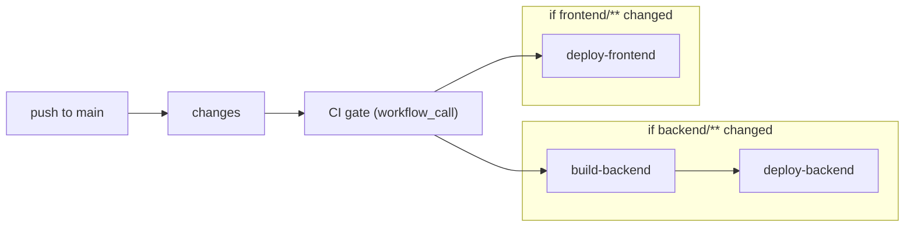

# Unified Deploy Workflow

## How env files interact with deploy

The new layered env system (`shared/infrastructure/env.py`) loads dotenv files at Python startup. Since `COPY backend/ .` includes `.env` and `.env.production` in the Docker image, the backend container already carries non-secret production defaults (pool sizes, worker count, token expiry, model names, timeouts).

Platform-injected env vars (`os.environ` set by App Platform before Python starts) always win over dotenv files because `PROCESS_ENV_KEYS` is never overwritten. So:

- `.env.production` in the image = **defaults** the container gets for free
- App Platform env vars (`.do/app.yaml` + dashboard secrets) = **overrides** when you need a different value or secrets
- `.do/app.yaml` only needs: secrets (type: SECRET), `ENV=production`, `PORT`, and anything you want to tune per-deployment without rebuilding

Non-secret keys already correct in `backend/.env.production` (`WORKERS`, `PG_POOL_*`, `JWT_ACCESS_EXPIRATION_MINUTES`) can be removed from `.do/app.yaml` since the image provides them.

For the frontend: `VITE_*` values are baked at build time. Populate `frontend/.env.production` with real production values (they are public - end up in the JS bundle). Then the deploy job's `pnpm build` picks them up via Vite's standard `.env.production` loading and no GitHub `vars.*` are needed.

## Design

Single workflow on push to `main`. A `changes` job detects which monorepo paths changed, then backend and frontend deploy independently in parallel - each only when their code changed - both gated on CI.



## Changes

### 1. Path-scope lint/format in [`.github/workflows/ci.yml`](.github/workflows/ci.yml)

Tests always run for both backend and frontend (backend API changes can break frontend expectations). Only **lint and format checks** are gated by path changes since they are purely static and independent.

Add a `changes` job using [`dorny/paths-filter@v4`](https://github.com/dorny/paths-filter) at the top of `ci.yml`.

On **pull_request** / **merge_group**, the `changes` job must set `permissions: pull-requests: read` so the action can fetch the modified file list from the GitHub API. On **push** to `main` / `dev`, use `actions/checkout` before the filter (git-based detection); for same-branch pushes, pass `base: ${{ github.ref }}` when needed per the action docs.

New job structure:

- **`changes`** - Outputs `backend: true/false`, `frontend: true/false`
  - `backend` filter: `backend/**`, `supabase/**`
  - `frontend` filter: `frontend/**`
- **`backend-lint`** - `needs: [changes]`, `if: needs.changes.outputs.backend == 'true'`. Runs: pixi doctor, uv sync, ruff check, ruff format --check, pip-audit. **Skipped** when no backend files changed.
- **`backend-test`** - Always runs (no `if:`). Runs: pixi doctor, uv sync, supabase setup + start + reset, pytest. Same steps as today's test portion.
- **`frontend-lint`** - `needs: [changes]`, `if: needs.changes.outputs.frontend == 'true'`. Runs: pixi doctor, pnpm install, eslint, prettier check, vite build. **Skipped** when no frontend files changed.
- **`frontend-test`** - Always runs (no `if:`). Runs: pixi doctor, pnpm install, vitest run.

This splits the current monolithic `backend` and `frontend` jobs into lint + test halves. Lint/format/build are fast-fail static checks that only matter when that side's code changed. Tests always run because cross-stack regressions are possible.

**`workflow_call` from deploy:** Both lint and test jobs still participate. The deploy workflow's own path filter gates which deploy jobs run; CI always validates the full test suite.

### 2. Rewrite [`.github/workflows/deploy.yml`](.github/workflows/deploy.yml)

Replace the current backend-only workflow with a unified one containing these jobs:

- **`changes`** - Uses `dorny/paths-filter@v4` to output `backend: true/false` and `frontend: true/false`. Checkout repo first; add `permissions: pull-requests: read` on this job for PR/merge-queue events.
- **`ci`** - `needs: [changes]`, runs if either changed, reuses [`ci.yml`](.github/workflows/ci.yml) via `workflow_call`
- **`build-backend`** - `needs: [changes, ci]`, `if: needs.changes.outputs.backend == 'true'`. Same Docker build + GHCR push logic as today.
- **`deploy-backend`** - `needs: [build-backend]`, `environment: backend_digital_ocean_deployment`. Runs `doctl` to trigger App Platform redeploy. Secrets scoped to the environment.
- **`deploy-frontend`** - `needs: [changes, ci]`, `if: needs.changes.outputs.frontend == 'true'`, `environment: frontend_vercel_deployment`. Steps: checkout, pixi setup, pnpm install, build, deploy via `amondnet/vercel-action@v42` with `--prod --prebuilt`. `VITE_*` values come from `frontend/.env.production` (committed) via Vite's standard loading - no GitHub `vars.*` needed.

Path filter definitions in the `changes` job:
- `backend`: `backend/**`, `.github/workflows/deploy.yml`
- `frontend`: `frontend/**`, `.github/workflows/deploy.yml`

Workflow-level `paths` trigger: `backend/**`, `frontend/**`, `.github/workflows/deploy.yml`

### 3. Slim down [`.do/app.yaml`](.do/app.yaml)

Remove non-secret keys that are already correct in `backend/.env.production` (baked into the Docker image). Keep only:
- `ENV=production` (explicit override so dotenv file order can't affect it)
- `PORT=8000` (App Platform convention)
- All `type: SECRET` entries (must come from platform)
- `CORS_ORIGINS`, `CORS_ORIGIN_REGEX`, `FRONTEND_URL`, `XERO_REDIRECT_URI` (deployment-specific URLs)
- `REDIS_URL` (empty for now, will change when Redis is added)

Remove: `WORKERS`, `PG_POOL_MIN`, `PG_POOL_MAX`, `PG_ACQUIRE_TIMEOUT`, `PG_COMMAND_TIMEOUT`, `LOG_LEVEL` (all have correct defaults in `.env.production` / `.env`)

### 4. Populate [`frontend/.env.production`](frontend/.env.production)

Replace the current comments-only file with real production values so Vite picks them up at build time:

```
VITE_BACKEND_URL=https://sku-ops-backend-xxxxx.ondigitalocean.app
VITE_SUPABASE_URL=https://xxx.supabase.co
VITE_SUPABASE_PUBLISHABLE_KEY=sb_publishable_...
```

These are public (baked into the JS bundle). This is the central source of truth for frontend production config.

### 5. Update [`.cursor/rules/deployment-hardening.mdc`](.cursor/rules/deployment-hardening.mdc)

Rewrite the CI/CD section to reflect:
- Single deploy workflow with change detection and parallel deploy
- Two GitHub Environments and their secrets
- Frontend deploy via Vercel Action from GitHub Actions
- Env layering: `.env.production` provides defaults, platform injects secrets and overrides
- `VITE_*` vars live in `frontend/.env.production` (committed)

## Secrets to populate

**`backend_digital_ocean_deployment` environment secrets:**

- `DIGITALOCEAN_ACCESS_TOKEN` - DO personal access token (API scope)
- `DIGITALOCEAN_APP_ID` - App Platform app UUID (`doctl apps list`)

**`frontend_vercel_deployment` environment secrets:**

- `VERCEL_TOKEN` - Vercel personal access token (Settings -> Tokens)
- `VERCEL_ORG_ID` - from `vercel link` / `.vercel/project.json` / Vercel dashboard
- `VERCEL_PROJECT_ID` - same source as org ID

No `vars.*` needed on `frontend_vercel_deployment` - `VITE_*` values come from `frontend/.env.production` in the repo.

## Note on Vercel Git integration

After this workflow is live, disable Vercel's **automatic Git deploys** for the project (Vercel dashboard -> Settings -> Git -> Deployments -> uncheck "Enable"). Otherwise Vercel will also deploy on push, duplicating the workflow.
