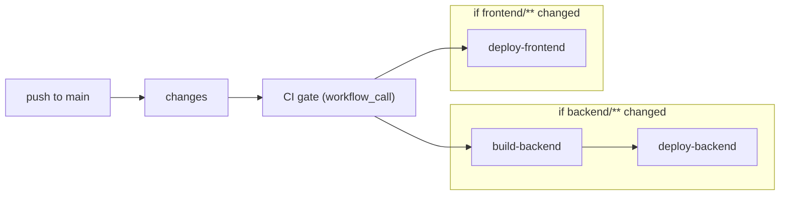

# Unified Deploy Workflow

## Design

Single workflow on push to `main`. A `changes` job detects which monorepo paths changed, then backend and frontend deploy independently in parallel - each only when their code changed - both gated on CI.

## Changes

### 1. Rewrite [`.github/workflows/deploy.yml`](.github/workflows/deploy.yml)

Replace the current backend-only workflow with a unified one containing these jobs:

- **`changes`** - Uses `dorny/paths-filter@v3` to output `backend: true/false` and `frontend: true/false`
- **`ci`** - `needs: [changes]`, runs if either changed, reuses [`ci.yml`](.github/workflows/ci.yml) via `workflow_call`
- **`build-backend`** - `needs: [changes, ci]`, `if: needs.changes.outputs.backend == 'true'`. Same Docker build + GHCR push logic as today.
- **`deploy-backend`** - `needs: [build-backend]`, `environment: backend_digital_ocean_deployment`. Runs `doctl` to trigger App Platform redeploy. Secrets scoped to the environment.
- **`deploy-frontend`** - `needs: [changes, ci]`, `if: needs.changes.outputs.frontend == 'true'`, `environment: frontend_vercel_deployment`. Steps: checkout, pixi setup, pnpm install, build (with `VITE_*` vars from environment), deploy via `amondnet/vercel-action@v42` with `--prod --prebuilt`.

Path filter definitions in the `changes` job:
- `backend`: `backend/**`, `.github/workflows/deploy.yml`
- `frontend`: `frontend/**`, `.github/workflows/deploy.yml`

Workflow-level `paths` trigger: `backend/**`, `frontend/**`, `.github/workflows/deploy.yml`

### 2. Update [`.cursor/rules/deployment-hardening.mdc`](.cursor/rules/deployment-hardening.mdc)

Rewrite the CI/CD section to reflect:
- Single deploy workflow with change detection
- Two GitHub Environments and their secrets
- Frontend deploy via Vercel Action from GitHub Actions
- `VITE_*` vars as environment variables (not secrets) on `frontend_vercel_deployment`

## Secrets to populate

**`backend_digital_ocean_deployment` environment secrets:**

- `DIGITALOCEAN_ACCESS_TOKEN` - DO personal access token (API scope)
- `DIGITALOCEAN_APP_ID` - App Platform app UUID (`doctl apps list`)

**`frontend_vercel_deployment` environment secrets:**

- `VERCEL_TOKEN` - Vercel personal access token (Settings -> Tokens)
- `VERCEL_ORG_ID` - from `vercel link` / `.vercel/project.json` / Vercel dashboard
- `VERCEL_PROJECT_ID` - same source as org ID

**`frontend_vercel_deployment` environment variables (non-secret `vars.*`):**

- `VITE_BACKEND_URL` - e.g. `https://sku-ops-backend-xxxxx.ondigitalocean.app`
- `VITE_SUPABASE_URL` - e.g. `https://xxx.supabase.co`
- `VITE_SUPABASE_PUBLISHABLE_KEY` - Supabase anon key (public, baked into JS)

These are `vars.*` not `secrets.*` because they end up in the browser JS bundle anyway.

## Note on Vercel Git integration

After this workflow is live, disable Vercel's **automatic Git deploys** for the project (Vercel dashboard -> Settings -> Git -> Deployments -> uncheck "Enable"). Otherwise Vercel will also deploy on push, duplicating the workflow.
