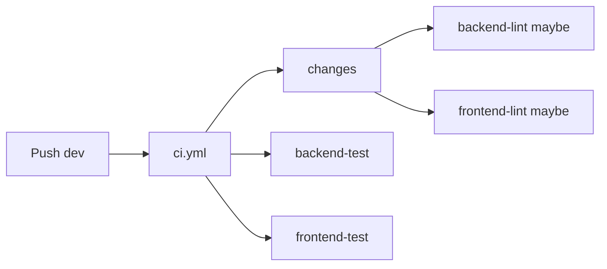
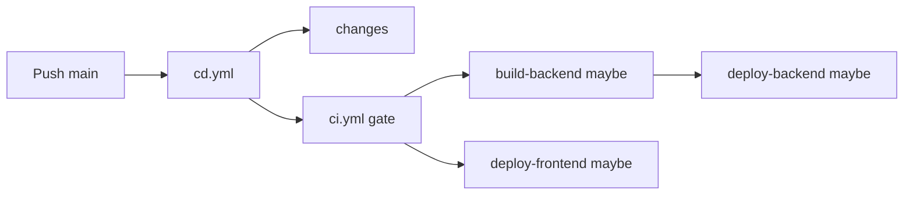
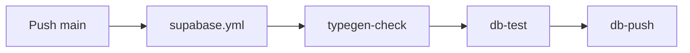

# CI / CD / Supabase

This document describes GitHub Actions for **CI** ([`.github/workflows/ci.yml`](../../../.github/workflows/ci.yml)), **CD** ([`.github/workflows/cd.yml`](../../../.github/workflows/cd.yml)), and **Supabase** ([`.github/workflows/supabase.yml`](../../../.github/workflows/supabase.yml)). Operational deploy details (secrets, infra) stay in [deploy.md](../../../docs/deploy.md) and [environment configuration](../../use-environment/references/overview.md).

## Goals

- **No duplicate test runs on `main`**: pushes to `main` only run **CD**, which calls `ci.yml` once as the CI gate. Standalone **CI** does not run on `main` pushes.
- **Integration branch `dev`**: every push runs full **CI** (lint where paths match, both test suites always).
- **Path-scoped deploy**: only rebuild / redeploy what changed, except manual CD (see below).
- **Database migrations**: **Supabase** workflow validates SQLModel codegen, runs SQLModel-focused tests, and can push migrations to production on `main` without coupling to the app CD pipeline.

## When workflows run

| Event | CI (`ci.yml`) | CD (`cd.yml`) | Supabase (`supabase.yml`) |
|-------|---------------|---------------|---------------------------|
| Push to `dev` | Yes (standalone) | No | Yes, when [Supabase path filters](#supabase-path-filters) match |
| Push to `main` | No (only via CD `workflow_call`) | Yes, when [CD path filters](#cd-path-filters) match | Yes, when Supabase path filters match |
| PR to `main` or `dev` | Yes | No | Yes, when Supabase path filters match |
| `workflow_dispatch` | Yes | Yes | Yes (always runs; use `--ref main` for production `db-push`) |

## CI behavior (`ci.yml`)

All jobs are gated by `dorny/paths-filter` on the `changes` job:

- **Backend (lint)**: runs when `backend/**` or `supabase/**` changed.
- **Backend (test)**: runs when `backend/**` or `supabase/**` changed (local Supabase + migrations).
- **Frontend (lint)**: runs when `frontend/**` changed.
- **Frontend (test)**: runs when `backend/**`, `supabase/**`, **or** `frontend/**` changed (Vitest). Backend changes trigger frontend tests to catch cross-stack regressions.

If nothing in `backend/`, `supabase/`, or `frontend/` changed, all four jobs are skipped.

### CI test matrix

| Change | Backend lint | Backend test | Frontend lint | Frontend test |
|--------|-------------|-------------|--------------|--------------|
| `backend/**` or `supabase/**` | Yes | Yes | No | Yes |
| `frontend/**` | No | No | Yes | Yes |
| Both | Yes | Yes | Yes | Yes |
| Neither | Skip | Skip | Skip | Skip |

**Concurrency:** `ci-${{ github.workflow }}-${{ github.ref }}` with `cancel-in-progress: true`. A new run on the same ref cancels an in-flight one (e.g. rapid pushes on `dev`).

## CD behavior (`cd.yml`)

1. **`changes`**: path filter on `push`; on **`workflow_dispatch`**, `backend_build`, `backend_deploy`, and `frontend` are all set to `true` (full pipeline).
2. **`ci` / CI gate**: reusable `ci.yml` (same jobs as standalone CI).
3. **`build-backend`**: if `backend_build`.
4. **`deploy-backend`**: if `backend_deploy` and CI succeeded (build may be skipped if only spec changed; image tag falls back to `latest`).
5. **`deploy-frontend`**: if `frontend`.

**Concurrency:** `deploy-prod` with `cancel-in-progress: false` (do not cancel an in-flight production deploy).

### CD path filters

CD itself only **starts** on `main` when these paths change:

- `backend/**`
- `frontend/**`
- `.do/**`
- `.github/workflows/cd.yml`
- `.github/workflows/ci.yml`

Inside the workflow, `changes` further splits **backend build** vs **backend deploy** (e.g. `.do/**` can trigger deploy without a Docker rebuild).

## Supabase behavior (`supabase.yml`)

Independent workflow for database-first checks and production migration push. Does **not** call `ci.yml` or `cd.yml`.

1. **`typegen-check`**: start local Supabase, `pixi run supabase typegen`, fail if `backend/shared/infrastructure/types/` drifts vs generated output.
2. **`db-test`**: reset local DB (`pixi run supabase reset`), run `backend/tests/unit/test_sqlmodel_generation/` and `backend/tests/integration/test_sqlmodel_db/` only.
3. **`db-push`**: `supabase link` + `supabase db push` to production, only when `github.ref` is `refs/heads/main` and the event is `push` or `workflow_dispatch` (not `pull_request`).

**Concurrency:** `supabase-${{ github.ref }}` with `cancel-in-progress: true`.

### Supabase path filters

The workflow **starts** on push / PR when any of these paths change:

- `supabase/**`
- `.cursor/skills/use-database/scripts/supabase_type_generation/**`
- `backend/shared/infrastructure/types/**`

`workflow_dispatch` ignores path filters (full workflow runs for the selected ref).

### Supabase production secrets

Configure GitHub Environment **`supabase_deployment`** (same as `environment:` in [`.github/workflows/supabase.yml`](../../../.github/workflows/supabase.yml)). Secrets (see [use-environment: Supabase migrations](../../use-environment/references/overview.md#github-actions-supabase-migrations)):

- `PRIVATE_ACCESS_TOKEN` (Supabase account access token for the CLI; workflow sets `SUPABASE_ACCESS_TOKEN`)
- `PRIVATE_DB_PASSWORD` (production database password; workflow sets `SUPABASE_DB_PASSWORD`)
- `PUBLIC_PROJECT_ID` (project ref for `supabase link --project-ref`; **must match** the project in the dashboard URL and `PUBLIC_SUPABASE_URL` in `backend/.env.production`, e.g. `fjzacucejlieklmmhwsm`. If this secret points at another project, `supabase config push` updates the wrong project.)
- `PRIVATE_ACCESS_TOKEN` must allow the Supabase CLI (`supabase link`, `supabase db push`, `supabase config push`) and the workflow **verify** step (`GET /v1/projects/{ref}/config/auth` read-only). Auth URLs come from root `[auth]` in `supabase/config.toml` via `config push`, not a separate PATCH.

Until this environment and secrets exist, `db-push` will fail at approval or secret resolution; `typegen-check` and `db-test` still run.

## Flow diagrams

### Push to `dev`



### Push to `main` (deploy-eligible paths)



### Push to `main` (Supabase-eligible paths)



## Manual runs (CLI / agents)

Requires [GitHub CLI](https://cli.github.com/) (`gh`) authenticated for the repo.

```bash
# Run CI on a branch (no deploy)
gh workflow run ci.yml --ref dev
gh workflow run ci.yml --ref main

# Run full CD: CI gate + build/deploy backend + deploy frontend (dispatch forces all deploy flags)
gh workflow run cd.yml --ref main

# Run Supabase pipeline (typegen, SQLModel tests, db-push if ref is main)
gh workflow run supabase.yml --ref main
```

Watch a run:

```bash
gh run watch
```

## Related workflows

**Codegen** (`.github/workflows/codegen.yml`) was renamed to **Supabase** (`supabase.yml`); behavior is documented in [Supabase behavior](#supabase-behavior-supabaseyml) above.

## Naming

- Workflow **names** in GitHub UI: **CI**, **CD**, and **Supabase**.
- Files: `ci.yml`, `cd.yml`, `supabase.yml`.
