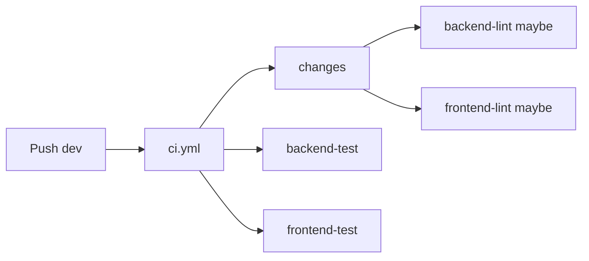
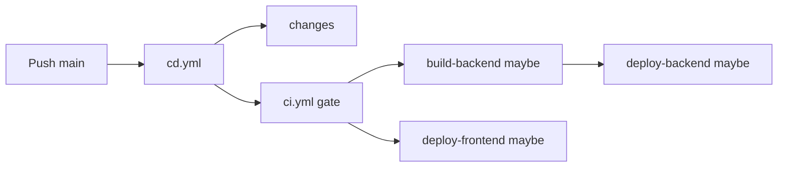

# CI / CD

This document describes GitHub Actions for **CI** ([`.github/workflows/ci.yml`](../.github/workflows/ci.yml)) and **CD** ([`.github/workflows/cd.yml`](../.github/workflows/cd.yml)). Operational deploy details (secrets, infra) stay in [deploy.md](./deploy.md) and [environment.md](./environment.md).

## Goals

- **No duplicate test runs on `main`**: pushes to `main` only run **CD**, which calls `ci.yml` once as the CI gate. Standalone **CI** does not run on `main` pushes.
- **Integration branch `dev`**: every push runs full **CI** (lint where paths match, both test suites always).
- **Path-scoped deploy**: only rebuild / redeploy what changed, except manual CD (see below).

## When workflows run

| Event | CI (`ci.yml`) | CD (`cd.yml`) |
|-------|---------------|---------------|
| Push to `dev` | Yes (standalone) | No |
| Push to `main` | No (only via CD `workflow_call`) | Yes, when [path filters](#cd-path-filters) match |
| PR to `main` or `dev` | Yes | No |
| `workflow_dispatch` | Yes | Yes |

## CI behavior (`ci.yml`)

- **Lint** (`Backend (lint)`, `Frontend (lint)`): gated by `dorny/paths-filter` on the `changes` job.
  - Backend paths: `backend/**`, `supabase/**`
  - Frontend paths: `frontend/**`
- **Tests** (`Backend (test)`, `Frontend (test)`): **always** run (backend uses local Supabase + migrations; frontend uses Vitest). This catches cross-stack regressions even when only one side changed.

**Concurrency:** `ci-${{ github.workflow }}-${{ github.ref }}` with `cancel-in-progress: true`. A new run on the same ref cancels an in-flight one (e.g. rapid pushes on `dev`).

## CD behavior (`cd.yml`)

1. **`changes`**: path filter on `push`; on **`workflow_dispatch`**, `backend_build`, `backend_deploy`, and `frontend` are all set to `true` (full pipeline).
2. **`ci` / CI gate**: reusable `ci.yml` (same jobs as standalone CI).
3. **`build-backend`**: if `backend_build`.
4. **`deploy-backend`**: if `backend_deploy` and CI succeeded (build may be skipped if only spec changed; image tag falls back to `latest`).
5. **`deploy-frontend`**: if `frontend`.

**Concurrency:** `deploy-prod` with `cancel-in-progress: false` (do not cancel an in-flight production deploy).

### CD path filters

CD itself only **starts** on `main` when these paths change:

- `backend/**`
- `frontend/**`
- `.do/**`
- `.github/workflows/cd.yml`
- `.github/workflows/ci.yml`

Inside the workflow, `changes` further splits **backend build** vs **backend deploy** (e.g. `.do/**` can trigger deploy without a Docker rebuild).

## Flow diagrams

### Push to `dev`



### Push to `main` (deploy-eligible paths)



## Manual runs (CLI / agents)

Requires [GitHub CLI](https://cli.github.com/) (`gh`) authenticated for the repo.

```bash
# Run CI on a branch (no deploy)
gh workflow run ci.yml --ref dev
gh workflow run ci.yml --ref main

# Run full CD: CI gate + build/deploy backend + deploy frontend (dispatch forces all deploy flags)
gh workflow run cd.yml --ref main
```

Watch a run:

```bash
gh run watch
```

## Related workflows

- **Codegen** ([`.github/workflows/codegen.yml`](../.github/workflows/codegen.yml)): separate Supabase / SQLModel generation checks; not part of CI/CD gating described here.

## Naming

- Workflow **names** in GitHub UI: **CI** and **CD**.
- Files: `ci.yml`, `cd.yml`.
