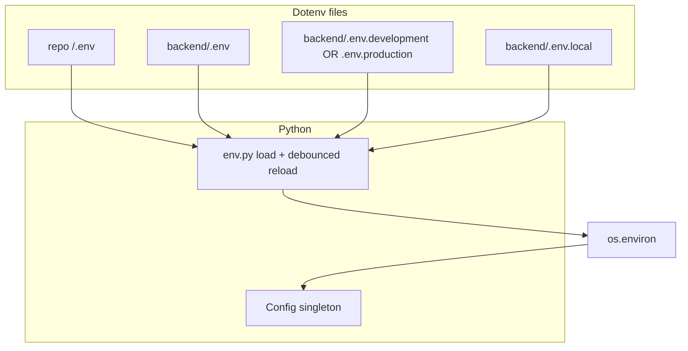

# Environment configuration

This document describes how SKU-Ops loads configuration for the **backend** (FastAPI) and **frontend** (Vite), and how the Python `Config` singleton behaves in development vs production.

Backend keys use a **`PUBLIC_` / `PRIVATE_` prefix**: non-secrets vs secrets. Legacy `ENV` is still accepted alongside `PUBLIC_ENV` when choosing the dotenv profile and runtime mode.

## Backend file hierarchy

All paths are relative to `backend/` unless noted.

| File | Committed | Purpose |
|------|-----------|---------|
| `.env` | Yes | Shared non-secret defaults (`PUBLIC_DB_USER`, `PUBLIC_DB_NAME`, pool sizes, model names, timeouts). |
| `.env.development` | Yes | Local dev (`PUBLIC_ENV`, `PUBLIC_DB_*`, `PUBLIC_SUPABASE_URL`, permissive `PUBLIC_CORS_ORIGINS`). |
| `.env.production` | Yes | Production non-secret hints (workers, pool sizes). Hosts inject secrets separately. |
| `.env.local` | No (gitignored) | Secrets (`PRIVATE_*`): DB password, API keys, `PRIVATE_JWT_SECRET`, etc. Copy from `.env.local.example`. |
| `.env.example` | Yes | Documentation template listing all variables. |

Optional **repo root** `.env` (legacy Docker / shared defaults) participates in the same merge as `backend/` files: lowest precedence among files.

### Load order and precedence

On import, `shared.infrastructure.env` snapshots **process** keys (`PROCESS_ENV_KEYS`: whatever is already in `os.environ` before that module body runs). Dotenv files are **merged in memory** in this order (each step overwrites the same key from earlier files):

1. Repo root `.env` (if present)
2. `backend/.env`
3. `backend/.env.development` or `backend/.env.production` (from runtime `PUBLIC_ENV`, with legacy `ENV` fallback, when `load_backend_dotenv_initial` runs)
4. `backend/.env.local`

Only keys **not** in `PROCESS_ENV_KEYS` are written to `os.environ`. So:

- **Platform / shell / CI / `pixi` / Docker** entries present before the interpreter loads `env.py` always win; no dotenv file can replace them.
- Among files only, **later wins**: `.env.local` overrides `.env.development` / `.env.production`, which overrides `backend/.env`, which overrides repo `.env`.

`PUBLIC_ENV=test` (pytest) uses the **same dotenv profile as development** (`.env.development`) for file names, but `PUBLIC_ENV` stays `test` if it was already set in the environment before import.

## Backend Python: `Config` singleton

Import the shared instance:

```python
from shared.infrastructure.config import config

db_url = config.DATABASE_URL
```

### Database connection (Postgres)

The app uses **SQLAlchemy + asyncpg** only. `config.DATABASE_URL` is always a `postgresql+asyncpg://...` URI suitable for `create_async_engine`.

**Default (recommended):** set the parts in env files or the host platform:

- `PUBLIC_DB_USER` and `PUBLIC_DB_NAME` in `backend/.env`
- `PUBLIC_DB_HOST`, `PUBLIC_DB_PORT`, `PUBLIC_DB_SSL_MODE` in `backend/.env.development` / `backend/.env.production`
- Local Supabase default password: `PUBLIC_DB_PASSWORD` in `backend/.env.development` (safe to commit)
- Hosted / production DB password: `PRIVATE_DB_PASSWORD` in `backend/.env.local` or the deployment platform

`config.py` builds the URL with `sqlalchemy.engine.URL.create()` so userinfo and query params are escaped correctly.

**URI override:** if `PRIVATE_DATABASE_URL` is set in the process environment (Docker Compose, CI, App Platform), it wins. Values may use `postgresql://` or `postgres://`; config rewrites them to `postgresql+asyncpg://`. Do not use port **6543** (Supabase transaction pooler) with asyncpg.

`config.DATABASE_URL_DISPLAY` is a password-safe `host:port/dbname` string for logs and `startup_summary`.

Development “non-local DB” warnings use `config.DB_HOST` (not only the parsed URL), so keep `PUBLIC_DB_HOST` aligned with the real server when you rely on the composed URL.

Implementation lives in:

- [`backend/shared/infrastructure/env.py`](../backend/shared/infrastructure/env.py) - finding `backend/`, layered `dotenv` merge + `PROCESS_ENV_KEYS`, debounced dev reload.
- [`backend/shared/infrastructure/config.py`](../backend/shared/infrastructure/config.py) - `Config` class, validation, JWT decode, `startup_summary`.

### Hot reload (development only)

When `PUBLIC_ENV=development`, each read path may trigger a **debounced** (2s) re-merge of:

- `backend/.env`
- `backend/.env.development`
- `backend/.env.local`

using the same rules as startup (merge with later files winning; **never** overwrite `PROCESS_ENV_KEYS`). Edits show up on subsequent `config.*` access without restarting uvicorn (no watchfiles).

**Caveat:** Some values are applied only at process startup (examples: SQLAlchemy pool, CORS middleware list in `main.py`, Sentry `init`). Changing those env vars still requires a restart for the infrastructure to pick them up; `config` will still return the new value when read.

`PUBLIC_ENV=test` and `PUBLIC_ENV=production` do **not** reload dotenv files from disk after startup.

### Production caching

When `PUBLIC_ENV=production`, string lookups from `os.environ` are **cached** on first read per key inside `Config` for performance. Mutating `os.environ` at runtime in production will not be visible through cached keys.

## Frontend (Vite)

Vite loads, in order (see [Vite env docs](https://vitejs.dev/guide/env-and-mode)):

- `.env`
- `.env.local`
- `.env.[mode]` (e.g. `.env.development`)
- `.env.[mode].local`

Only variables prefixed with `VITE_` are exposed to the client bundle.

| File | Committed | Typical content |
|------|-----------|-----------------|
| `frontend/.env` | Yes | Shared comments / optional defaults. |
| `frontend/.env.development` | Yes | e.g. `VITE_SUPABASE_URL` for local stack. |
| `frontend/.env.production` | Yes | Placeholder comments; real production values often live in Vercel. |
| `frontend/.env.local` | No | `VITE_SUPABASE_PUBLISHABLE_KEY` and other local-only values. |

**Production builds:** `VITE_*` values are baked in at `pnpm run build` time; changing them requires a new build/deploy.

## Adding a new backend setting

1. Add the key with `PUBLIC_` or `PRIVATE_` to the appropriate file (`backend/.env` for shared non-secrets, `.env.development` / `.env.production` for mode-specific non-secrets, `.env.local` / platform for secrets).
2. Add a `@property` on `Config` in `config.py`.
3. Update [`backend/.env.example`](../backend/.env.example).
4. Document security and production requirements here or in [`deployment-hardening.mdc`](../.cursor/rules/deployment-hardening.mdc).

## Troubleshooting

- **Wrong DB or mode in tests:** Ensure [`backend/tests/conftest.py`](../backend/tests/conftest.py) sets `PUBLIC_ENV=test` before imports that load `config` (it does).
- **Expected key missing / wrong value:** If `PRIVATE_DATABASE_URL`, `PUBLIC_DB_HOST`, or any other key is set in your shell or `pixi` task env before Python starts, dotenv files cannot override it; unset the shell copy or rely on platform-only injection in deploy.
- **Production CORS crash:** Empty or `*` `PUBLIC_CORS_ORIGINS` in production raises at `Config` init; set explicit origins on the host.
- **Supabase JWKS errors after URL change:** `Config` resets the JWKS client when `PUBLIC_SUPABASE_URL` changes between reads (development).

## Inheritance diagram (conceptual)



`DevelopmentEnv` / `ProductionEnv` in `env.py` are markers for documentation; loading is procedural (`load_backend_dotenv_initial`, `maybe_reload_backend_dotenv_development`).
