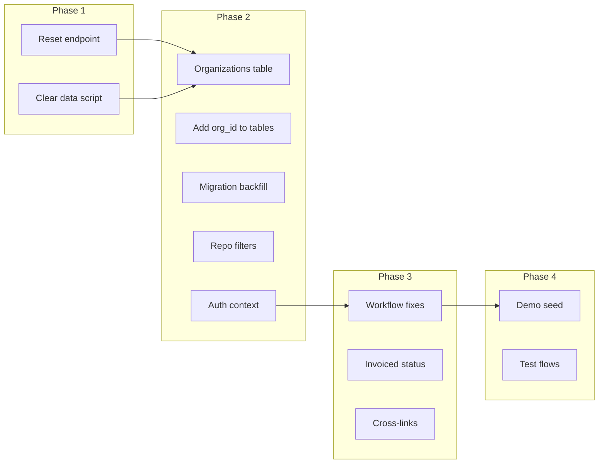

# Multi-Tenant Demo Plan

**Status:** Planning  
**Prerequisites:** All work committed and pushed. Backend DB init OK. Server loads OK.

---

## 1. Current State Summary

### Data Model (No Tenant Segregation)
- **Users** have `role` (admin, warehouse_manager, contractor), `company`, `billing_entity` — but no `org_id` / `tenant_id`
- **Products, Departments, Vendors** — shared across all users; no tenant scoping
- **Withdrawals** — linked to `contractor_id` (user); contractor sees own history
- **Invoices** — linked to withdrawals via `billing_entity`; no tenant
- **Single SQLite DB** — one schema, one dataset

### Workflow Gaps (from prior analysis)
- Financials vs Invoices — split experience, no cross-nav
- "Mark Paid" vs invoice lifecycle — two paths, unclear flow
- `payment_status` "invoiced" never set when adding to invoice (data bug)
- Contractor My History — no "invoiced" state
- Warehouse managers can't access Financials/Invoices

### Integrations
- Xero — stub only
- ServiceM8 — not implemented

---

## 2. Phase 1: Clear Data & Reset Capability

### 2.1 Data Reset
- **Option A:** Add `POST /api/seed/reset` (dev/demo only) — truncates core tables, reseeds departments, optional demo users
- **Option B:** Delete `backend/data/sku_ops.db*` and restart — fresh init_db
- **Option C:** Migration script that clears data but preserves schema

**Recommendation:** Option A — controlled reset endpoint guarded by `ENV=development` or `ALLOW_RESET=true`

### 2.2 Tables to Clear (in order for FK)
1. `invoice_line_items`, `invoice_withdrawals`
2. `invoices`, `invoice_counters`
3. `payment_transactions`
4. `withdrawals`
5. `stock_transactions`
6. `products`
7. `sku_counters`
8. `vendors`, `departments` (or reseed)
9. `users` (or keep admin, reset others)

---

## 3. Phase 2: Tenant Segmentation

### 3.1 Tenant Model
Introduce **Organization** (tenant):

```
organizations
  id, name, slug, created_at
```

### 3.2 Schema Changes
Add `organization_id TEXT NOT NULL` (or `org_id`) to:
- `users` — which org the user belongs to
- `departments` — org-scoped (dept codes unique per org)
- `vendors` — org-scoped
- `products` — org-scoped (via department or direct)
- `withdrawals` — org-scoped (via contractor → user → org)
- `invoices` — org-scoped
- `payment_transactions` — org-scoped
- `stock_transactions` — org-scoped via product
- `sku_counters` — key by `(org_id, department_code)` or `org_id|department_code`
- `invoice_counters` — org-scoped

### 3.3 Auth & Context
- Resolve `organization_id` from `current_user` (user belongs to one org)
- All repo queries filter by `organization_id`
- Contractors: must belong to an org; withdrawals filtered by org + contractor

### 3.4 Migration
- Add `organizations` table
- Add `organization_id` to existing tables
- Create default org, assign all existing rows to it
- Backfill: `UPDATE users SET organization_id = ? WHERE organization_id IS NULL`

---

## 4. Phase 3: Ideal Workflows to Implement

### 4.1 Core User Flows
| Flow | Actors | Steps |
|------|--------|-------|
| **Withdrawal → Charge to Account** | Contractor/WM | POS → unpaid withdrawal → invoice via Xero |
| **Unpaid → Invoice** | Admin | Financials → select withdrawals → Create Invoice |
| **Invoice → Sent → Paid** | Admin | Invoices → Send to Xero → mark paid when paid |
| **Contractor view** | Contractor | My History: see unpaid, invoiced, paid |

### 4.2 Workflow Fixes (from prior analysis)
1. **Set `payment_status = 'invoiced'`** when withdrawal added to invoice
2. **Cross-links:** Financials ↔ Invoices (view invoice from withdrawal, view withdrawals from invoice)
3. **Invoice paid:** When marking invoice paid, cascade to withdrawals
4. **Contractor My History:** Show "Invoiced" state

### 4.3 Integrations to Assess
| Integration | Priority | Notes |
|-------------|----------|-------|
| **Xero** | High | Draft invoice → Xero; sync payment status |
| **ServiceM8** | Medium | Job ID dropdown; optional |
| **Barcode scanner** | Medium | POS search by scan |

---

## 5. Phase 4: Fully Functional Multi-Tenant Demo

### 5.1 Demo Tenants (Seed)
- **Org A:** "Supply Yard North" (slug: `north`)
- **Org B:** "Supply Yard South" (slug: `south`)

### 5.2 Demo Users (per org)
| Org | Role | Email | Purpose |
|-----|------|-------|---------|
| North | admin | admin@north.demo | Full access |
| North | warehouse_manager | wm@north.demo | POS, inventory |
| North | contractor | contractor@north.demo | Withdraw, pay/charge |
| South | admin | admin@south.demo | Full access |
| South | warehouse_manager | wm@south.demo | POS, inventory |
| South | contractor | contractor@south.demo | Withdraw, pay/charge |

### 5.3 Demo Data (per org)
- Same department structure (LUM, PLU, ELE, etc.) — org-scoped
- ~50–100 products per org (from CSV or generated)
- 0–2 vendors per org
- Optional: a few withdrawals and an invoice for North

### 5.4 Key Demo Flows to Validate
1. **Login as admin@north.demo** → see only North data
2. **Login as contractor@north.demo** → POS, withdraw, see own history
3. **Login as admin@south.demo** → completely separate data
4. **Financials** → Create invoice from unpaid → view on Invoices
5. **Cross-tenant isolation** → North admin cannot see South products

---

## 6. Implementation Order



### Suggested Order
1. **Phase 1** — Reset endpoint (quick win, enables clean slate)
2. **Phase 2** — Organizations + schema + migration + repo filters (core multi-tenant)
3. **Phase 3** — Workflow fixes (invoiced status, cross-links)
4. **Phase 4** — Demo seed + validation

---

## 7. File Impact (Phase 2)

| Area | Files |
|------|-------|
| DB | `db.py` — new table, new columns, migration |
| Models | `organization.py`, update Product, User, etc. |
| Repos | All repos — add `organization_id` filter |
| Auth | `auth.py` — include org in token/context |
| API | All routes — pass org from user |
| Seed | `seed.py` — orgs, users per org, products per org |
| Frontend | Layout — org switcher? Or implicit from login |

---

## 8. Open Questions

1. **Org per user or multi-org?** — One user = one org (simpler) vs user can belong to multiple orgs
2. **Org switcher in UI?** — If single-org, no. If multi-org, need switcher.
3. **Seed data source** — Same CSV for both tenants, or different subsets?
4. **Xero scope** — Per-org Xero credentials, or single Xero with branch/org mapping?
